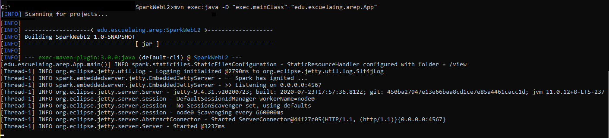
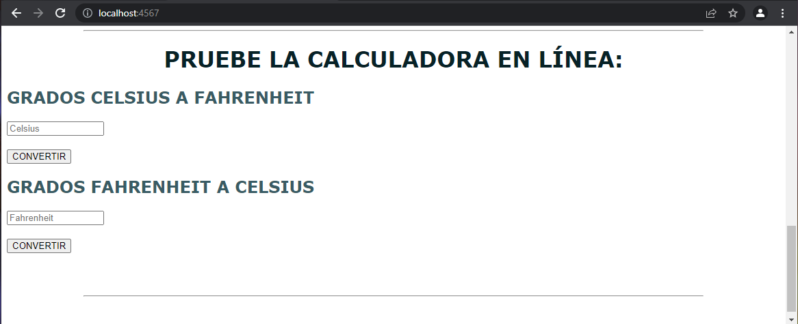
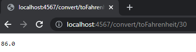
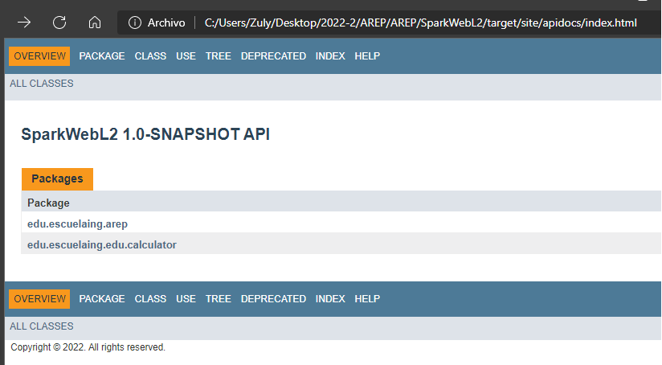

# INTRODUCCIÓN MVN GIT, HEROKU y SPARK

El propósito de este proyecto consiste en construir una API Rest que permita hacer la conversión tanto de grados Celsius a Fahrenheit como de Fahrenheit a Celsius. De igual forma se incluye la construcción de un sitio web desplegado en heroku para su demostración y uso.

## Cómo empezar

A continuación podrá encontrar los pasos ccon los cuales puede acceder al sitio web o usar el proyecto de manera local.

### Prerrequisitos

* [Maven](https://maven.apache.org/) - Administrador de dependencias
* [Java ](https://www.oracle.com/co/java/technologies/javase/javase-jdk8-downloads.html)       Ambiente de desarrollo
* [Git](https://git-scm.com/) - Sistema de control de versiones

### Instalación

Para descargar el proyecto ejecute 

    git clone https://github.com/ZulyVargas/AREP_labSpark.git

Para ejecutar desde la ubicación del proyecto 

    mvn clean package exec:java -D "exec.mainClass"="edu.escuelaing.arep.App"

En su navegador ingrese a la siguiente dirección para visualizar y utilizar la calculadora : 

    http://localhost:4567

Para hacer las conversiones correspondientes sin usar interfaz visual :
(A Fahrenheit) http://localhost:4567/convert/toFahrenheit/"valor"

(A Celsius) http://localhost:4567/convert/toCelsius/"valor"

## Ejecución de  pruebas

    mvn test

###Pruebas concurrentes :

Para la ejecución de pruebas concurrentes las cuales permiten demostrar que la API soporta hasta más de 10 peticiones al tiempo se creo una nueva clase ConcurrentAppTest,
en esta se ejecutan 10 hilos donde la mitad de ellos realizan peticiones para conversión de grados Celsius y la otra mitad para
conversión de grados Fahrenheit. A continuación se puede observar los códigos de respuesta y el número de peticiones realizadas.

## Despliegue

## Documentación
Para generar la documentación se debe ejecutar:

    mvn javadoc:javadoc
Esta quedará en la carpeta target/site/apidocs :

O diríjase a la siguiente dirección: 
* [Documentación](https://github.com/ZulyVargas/AREP_labSpark/blob/master/SparkWebL2/javadocs/index.html)

## Construido con 

* [Maven](https://maven.apache.org/) - Administrador de dependencias
* [Spark](http://sparkjava.com) - Framework para desarrollo de aplicaciones web
* [Heroku](https://heroku.com) - Plataforma de despliegue

## Autores

* **Zuly Valentina Vargas Ramírez** 

## Licencia

Este proyecto esta bajo la licencia GNU(General Public License) los detalles se encuentran en el archivo [LICENSE](LICENSE.txt).
